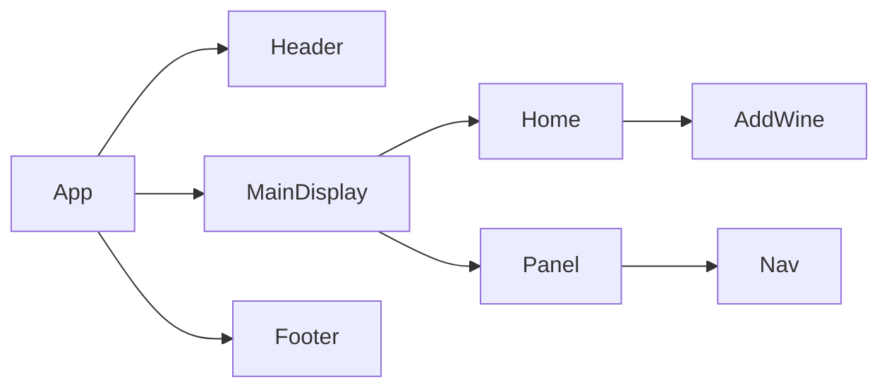

# Product Requirements Documentation

**Summary**
| Field | Detail |
|-------|--------|
| Project Name | SkyCotl - A Sky Community|
| Description |A place for Sky aficionados to commune and share game info |
| Developers | Calvin Harris |
| Live Website | TBA |
| Repo | https://github.com/Newbclharri/django_sky,  |
| Planning | https://miro.com/app/board/uXjVOihbQvw=/ |
| Technologies | HTML,CSS, JavaScript, Python, Django, Jinja, PostgreSQL, AWS, Heroku, Miro, Github, Postman. |

## Things I Want to Improve:
- Create Add friends functionality
 - blog post functionality
 - Display friends that have spirits in common
 - Display stats: (Friends that have more Spirts and Winged Light)

## Problem Being Solved and Target Market

Sky Children of the Light is a popular game played by many around the world via android, apple ios, and Nintend Switch devices.  SkyCotl - A Sky Community brings players together to share adventures and discoveries.

## User Stories

- As a user, I want to register sign in credentials
- As a user, I want to add, view, edit and delete spirits
- As a user, I want to add, view, and update discovered winged light

## Route Tables

path('', views.home, name='home'),
    path('accounts/signup/', views.signup, name='signup'),
    path('accounts/edit_profile/', views.UserEditView.as_view(), name = 'edit_profile'),
    path('accounts/add_profilepic/', views.add_profilepic, name='add_profilepic'),
    path('spirits/', views.SpiritList.as_view(), name='spirits_index'),
    path('spirits/create/',views.SpiritCreate.as_view(), name='spirits_create'),
    path('spirits/<int:pk>/', views.SpiritDetail.as_view(), name='spirits_detail'),
    path('spirits/<int:pk>/update/', views.SpiritUpdate.as_view(), name='spirits_update'),
    path('spirits/<int:pk>/delete/', views.SpiritDelete.as_view(), name='spirits_delete'),
    path('wingedlight/', views.WingedLightList.as_view(), name='wingedlight_index'),
    path('wingedlight/<int:pk>/', views.WingedLightDetail.as_view(), name='wingedlight_detail'),
    path('wingedlight/create/', views.WingedLightCreate.as_view(), name='wingedlight_create'),
    path('wingedlight/<int:pk>/update/', views.WingedLightUpdate.as_view(), name='wingedlight_update'),
    path('wingedlight/<int:pk>/delete/', views.WingedLightDelete.as_view(), name='wingedlight_delete'),

## Component Architecture

## User Interface Mockups

